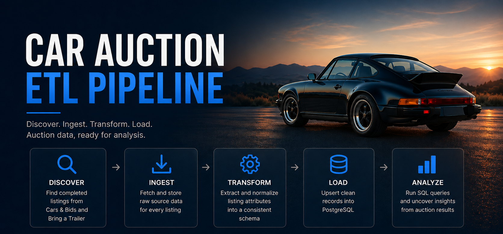
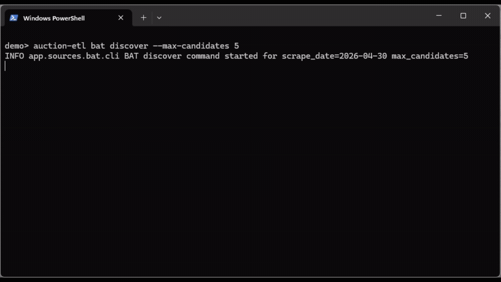

# Car Auction ETL

<p align="center">
  
</p>

<p align="center">
  <strong>Built for enthusiasts who want to understand the market.</strong>
</p>

<p align="center">
  
  
  
  
  
  
</p>

---

## What It Is

Car Auction ETL is a Python CLI pipeline for collecting completed vehicle auction data from Bring a Trailer and Cars & Bids, preserving raw source artifacts, and loading normalized records into Postgres.

It supports:

- Discovery of completed auction listings from supported sources.
- Single-listing and batch ingestion from live source pages and APIs.
- Raw source storage for HTML and JSON artifacts before transformation.
- Source-specific normalization into vehicle and sale fields.
- Postgres loading with uniqueness constraints by source and listing ID.
- Unit and integration tests for the core ETL flow.

<p align="center">
  
</p>

## CLI

Install dependencies before using the console script. Commands use this top-level format:

```text
auction-etl bat ...
auction-etl cab ...
```

Supported sources:

- `bat`: Bring a Trailer
- `cab`: Cars & Bids

| Command | Purpose |
| --- | --- |
| `auction-etl <source> ingest --listing-id <id>` | Fetch and store raw source data for one listing. |
| `auction-etl <source> transform --listing-id <id>` | Transform and load one previously ingested listing. |
| `auction-etl <source> run --listing-id <id>` | Ingest, transform, and load one listing end to end. |
| `auction-etl <source> discover [--scrape-date YYYY-MM-DD] [--max-candidates N]` | Discover completed auction listings for a source. |
| `auction-etl <source> ingest-discovered [--batch-size N]` | Ingest raw source data for discovered listings. |
| `auction-etl <source> transform-discovered [--batch-size N]` | Transform and load discovered listings that have raw data. |

## Quick Start

```text
# 1. Clone and install
git clone https://github.com/Cameron831/car-auction-etl.git
cd car-auction-etl
python -m pip install -r requirements.txt
python -m playwright install chromium

# 2. Start Postgres
docker compose up -d postgres

# 3. Configure local environment
# macOS/Linux:
cp .env.example .env
# Windows PowerShell:
Copy-Item .env.example .env

# 4. Check setup
python -m pytest -q

# 5. Run the CLI
auction-etl bat run --listing-id 2016-porsche-boxster-spyder-55
auction-etl cab run --listing-id rGJlwggO
```

## Data Model

### Tables

| Table | Purpose |
| --- | --- |
| `listings` | Normalized vehicle and sale records loaded from supported auction sources. |
| `discovered_listings` | Candidate listing URLs found during discovery, with eligibility and ingestion status. |
| `raw_listing_html` | Raw Bring a Trailer listing HTML captured before transformation. |
| `raw_listing_json` | Raw Cars & Bids listing JSON captured before transformation. |

### Normalized Listing Fields

| Field | Notes |
| --- | --- |
| `source_site` | Source identifier, such as `bat` or `cab`. |
| `source_listing_id` | Source-native listing ID; unique with `source_site`. |
| `url` | Original listing URL. |
| `make`, `model_raw`, `model_normalized`, `year` | Vehicle identity fields. |
| `mileage`, `vin`, `transmission` | Optional vehicle details when available. |
| `sale_price`, `sold`, `auction_end_date` | Auction result fields. |
| `listing_details_raw` | Source-specific details retained as JSON. |

## Future Work

- Improve model and generation normalization mappings for more consistent comparisons across listings.
- Fix known source parsing edge cases, including percent-encoded listing IDs, ambiguous transmissions, and replica/manufacturer-year handling.
- Add operational hardening with retry behavior, parallel batch processing, and configurable CLI logging modes.
- Support scheduled production runs backed by managed Postgres, such as AWS PostgreSQL.
- Build a front-end dashboard for exploring normalized listings and price trends.

## License

This project is licensed under the MIT License. See [LICENSE](LICENSE).
